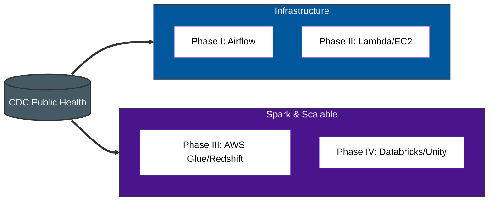

# CDC ETL Pipelines
The three Center Disease Control datasets are used in four project phases: Phase I, II, III, and IV.

### CDC public-health dataset
This unified CDC dataset tracks chronic conditions, heart disease mortality (2019-2021), and BRFSS lifestyle behaviors (via CDC phone survey tracking: current smokers, physical activity, weight categories, etc.). It combines state and county health metrics to outline cardiovascular risks and population health habits across the U.S.

**Phase I** runs a **traditional Airflow ETL**, ingesting all three CSVs for baseline cleaning and loading. 

**Phase II** uses a **hybrid Lambda/EC2 Pandas workflow on aws** focused on the Nutrition dataset with automated validation.

**Phase III** integrates **GitHub Actions with a serverless Spark pipeline** (AWS Lambda/Glue/Redshift) to extract datasets from data.gov and load them into Redshift, automating transformations and ensuring reliable data pipelines.

**Phase IV** runs a **Databricks Community Edition PySpark ELT**, loading datasets to Unity Catalog volumes.

**Note:** The AWS project includes minimal EDA/analysis, as a separate Cloud dbt project already covers it:

[Cloud CDC dbt ELT Project](https://github.com/masabai/cloud_center_disease_etl_dbt)

### Phase I: Traditional CDC ETL Pipeline with Airflow DAG
Demonstrates a classic, local ETL workflow using Airflow, Pandas, Postgres, and Great Expectations(GX).
Dataset: Three CDC CSVs contain chronic disease, heart disease, and nutrition metrics, serving as a baseline for all subsequent phases. Automated CI testing is implemented with GitHub Actions, executing the full Pytest suite on each push to validate ETL functionality and data quality.

#### Flow chart: data.gov → E (local) → T (Pandas) → L (Postgres) → Validate (GX) → DAG -> Slack/Email notifications

Extract (E): Airflow extracts the three CDC CSV files and copies them into the local raw/ directory.

Transform (T): Pandas cleans, standardizes, and enriches the raw data into structured outputs stored in the processed/ directory.

Load (L): Airflow loads the processed data into the local Postgres database for downstream analysis.

Validate (V): Great Expectations(GX) validates schema, types, and quality checks using expectations stored locally.

Notify (N): Airflow sends Slack notifications on success or failure at the end of the DAG run.

**Scheduling**:
Pipeline orchestrated via Airflow DAG, configured in Desktop Docker. The pipeline dynamically reports success/failure via Slack notifications.

Testing:
Local pytest suite validates all ETL stages including DAG structure, data extraction, transformations, and Great Expectations validation rules. Integration and regression tests ensure pipeline consistency across CDC datasets. CI runs the full test suite on every commit via GitHub Actions.

### Phase II: AWS CDC ELT Pipeline — Hybrid (Pandas)
This phase shows end-to-end data pipeline on AWS using only free-tier services, uses EC2 and Lambda together in a hybrid setup.
Dataset is small on purpose, to keep cost low or free but still show full pipeline flow like architecture, orchestration, validation, and basic production-style work.

Final data is loaded into Amazon QuickSight for dashboard and analysis.

#### Flow chart: data.gov-> E (data.gov)-> L(s3)-> T(S3)-> L(s3/Athena)-> V(EC2)-> Step Functions -> SNS-> EventBridge

Extract (E): AWS Lambda extracts the raw dataset from data.gov and stores it in s3://center-disease-control/raw/.
  - [Extract & Load CSV Screenshot](https://github.com/masabai/aws-center-disease-etl/blob/master/phase2-pandas-aws-hybrid/pandas_etl_screenshots/extract_load_csv.png)

Transform (T): Pandas transformations performed inside Lambda: data cleaning, type conversions, enrichment.
Cleaned data written as Parquet files to s3://center-disease-control/processed/.
  - [Transform & Load CSV Screenshot](https://github.com/masabai/aws-center-disease-etl/blob/master/phase2-pandas-aws-hybrid/pandas_etl_screenshots/transform_load_csv.png)

Load (L): Athena tables created on processed Parquet data for downstream queries. Processed dataset verified via Athena queries. Athena tables are created manually from processed S3 Parquet; in production, this step can be automated using Glue Crawlers or boto3 scripts.
  - [Load Table in Athena Screenshot](https://github.com/masabai/aws-center-disease-etl/blob/master/phase2-pandas-aws-hybrid/pandas_etl_screenshots/load_table_athena.png)

Validate (V): Great Expectations (GX) runs on EC2 (hybrid model). The Lambda function invokes GX via AWS Systems Manager Run Command.
JSON result automatically saved to s3://center-disease-control/processed/validation/ for review.

  - [ELT on EC2 Screenshot](https://github.com/masabai/aws-center-disease-etl/blob/master/phase2-pandas-aws-hybrid/pandas_etl_screenshots/etl_ec2_instance.png)  
  - [Verify GX Result Screenshot](https://github.com/masabai/aws-center-disease-etl/blob/master/phase2-pandas-aws-hybrid/pandas_etl_screenshots/verify_gx_result.png)

Visualization: Data loaded into Amazon QuickSight (Quick Suite) for analysis.
  - [QuickSight Analysis Screenshot](https://github.com/masabai/aws-center-disease-etl/blob/master/phase2-pandas-aws-hybrid/pandas_etl_screenshots/quicksuite_analysis.png)

**Scheduling**:
Pipeline orchestrated via AWS Step Functions and scheduled with EventBridge. Pipeline dynamically reports success/failure in Step Functions, with SNS notifications.

### Phase III — CDC ELT with Spark (Serverless)
Demonstrates an automated, serverless ELT pipeline for CDC datasets using AWS Lambda and Glue Spark. GitHub Actions (using OIDC authentication) triggers the AWS workflow, while AWS Step Functions orchestrate the Extract, Transform, and Load stages. SNS provides monitoring and notifications throughout the pipeline.
#### Flow chart: data.gov → Extract (Lambda) → Load (S3) -> Transform (Glue Spark) → Load (Lambda/Redshift) → Step Functions → SNS

Extract (E): Reuses the same Lambda function from Phase I.
- [Extract & Load CSV Screenshot](https://github.com/masabai/aws-center-disease-etl/blob/master/phase2-pandas-hybrid/pandas_etl_screenshots/extract_load_csv.png)

Transform (T): AWS Glue Job (Spark) handles scalable transformations and data cleaning.

Load (L): Lambda function loads the cleaned datasets into Amazon Redshift for analytics-ready access.

- [Glue Transform Run Screenshot](https://github.com/masabai/aws-center-disease-etl/blob/stable/phase3-spark-aws-serverless/spark_etl_screenshots/glue_transform_run.png)

- [Load to Redshift Lambda Log Screenshot](https://github.com/masabai/aws-center-disease-etl/blob/stable/phase3-spark-aws-serverless/spark_etl_screenshots/load_redshift_lambda_log.png)

Verify: Check that the transformed data has been correctly loaded into Redshift.  

- [Verify Rows in Redshift Screenshot](https://github.com/masabai/aws-center-disease-etl/blob/stable/phase3-spark-aws-serverless/spark_etl_screenshots/verify_rows_redshift.png)

Note: Validation (V): Great Expectations(GX) step skipped, already included in Phase I and II — Glue and EC2 Spark validation can be cost-heavy for the free tier.

**Scheduling**:
The pipeline is triggered via GitHub Actions, which initiates the serverless ELT workflow. Step Functions orchestrates the ELT stages (Extract → Load -> Transform), while SNS notifications report success or failure at each step.

### Phase IV: Basic CDC ELT with PySpark in Databricks Community Edition
Re-create the CDC ELT pipeline inside a managed Spark environment using Databricks Community Edition (DBCE).
The pipeline has been implemented in both Databricks Jobs and Pipelines, showcasing flexibility in orchestration methods. Key highlights include:

PySpark transformations: Clean, transform, and load datasets to Delta Live Tables and CSV folders.
Data validation with Great Expectations (GX): Ensure data quality is enforced before loading.
Loading to Unity Catalog volumes: Store processed datasets in managed, shareable storage.

Scheduling and orchestration: Implemented via Databricks Jobs and Pipelines to demonstrate different workflow management approaches.

#### Flow chart: data.gov-> (s3)-> E (DBCE) -> T(DBCE)-> V(DBCE)->L(DBCE)-> job runs

